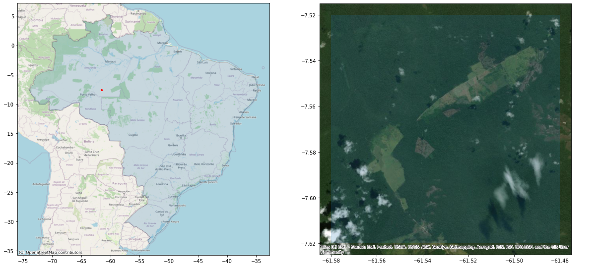
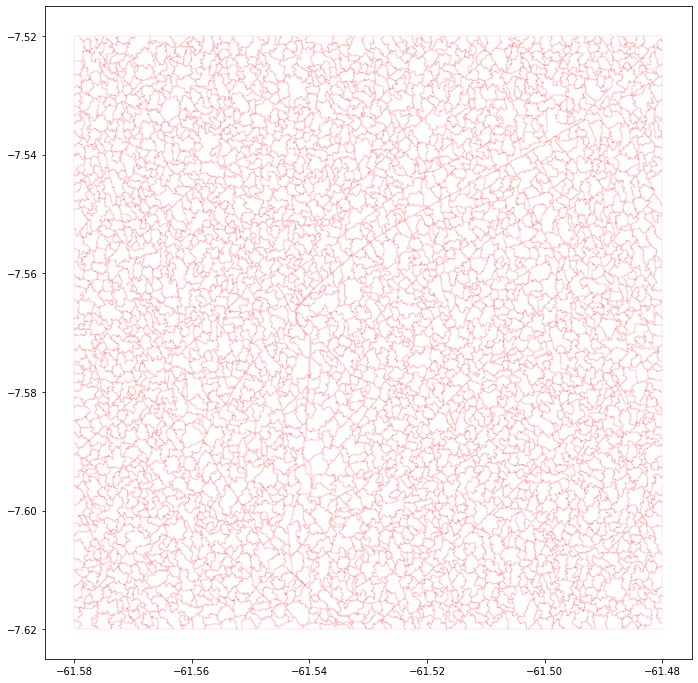
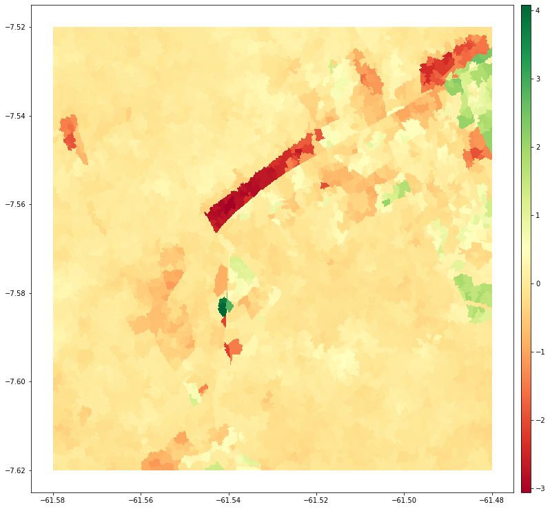
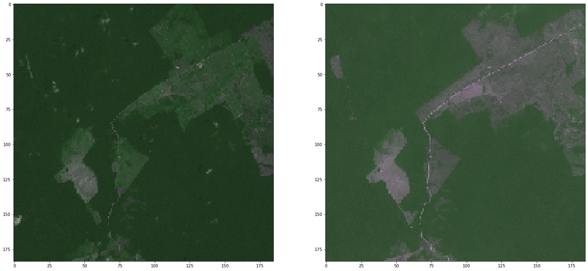

# BFast monitoring with SentinelHub


This repository has a minimal working example of using [Sentinel-Hub services](https://www.sentinel-hub.com) together with [BFast monitor](https://bfast.r-forge.r-project.org) to detect forest change. The `Dockerfile` allows users to prepare a docker image with all the needed software to run the `bfast_monitoring_with_SentinelHub.ipynb` Jupyter notebook. This file walks the user through the steps.

### Preparing the docker image

Create the docker image by running

```bash
docker build -f Dockerfile -t sh-bfast . 
```

Run the docker

```bash
docker run -d -p 8080:8888 -v $PWD:/home/eolearner --name bast sh-bfast:latest
```

The jupyter environment is now set up on your http://localhost:8080. You can open the notebook from this repository directly at http://localhost:8080/notebooks/bfast_monitoring_with_SentinelHub.ipynb.

### Sentinel-Hub access

The access to Sentinel-2 imagery is done through the [Sentinel-Hub services](https://www.sentinel-hub.com), particularly by using Python libraries [sentinelhub-py](https://sentinelhub-py.readthedocs.io/en/latest/) and [eo-learn](https://eo-learn.readthedocs.io/en/latest/). In this example, we have used an area of interest in the Brazil.



The image on the right shows the approximate location, while the image on the right shows the area over a true-color imagery, showing the well-known issue of clouds.

### Super-pixels

The approach in this example will first create super-pixels of the area. The algorithm used is [Felzenszwalb’s method of segmentation](https://eo-learn.readthedocs.io/en/latest/eolearn.geometry.superpixel.html?highlight=FelzenszwalbSegmentation#eolearn.geometry.superpixel.FelzenszwalbSegmentation), and will segment the area of interest into superpixels that have similar (spectral) properties both in spatial as well in temporal dimensions. The resulting super-pixels are vectorised to provide a placeholder for results from BFast. 



### BFast

BFast monitor is then run on superpixels, the user providing the monitoring period. We have wrapped the calls to `R` into a Python function; as all the needed packages for running BFast are available in the docker image, this part should be straightforward.

The results are then applied back into the (vectorized) superpixels, and the resulting `GeoDataFrame` has following attributes:

|      | geometry                                          | breakpoint | magnitude |
| ---- | ------------------------------------------------- | ---------- | --------- |
| 0    | POLYGON ((-61.55977 -7.52000, -61.55796 -7.520... | 2020-02-09 | 0.030134  |

allowing us to visualize the changes:



or to find the breakpoints when the largest changes happened:

| breakpoint | magnitude_min | magnitude_max |
| ---------- | ------------- | ------------- |
| 2020-03-22 | -3.038306     | 0.333422      |
| 2020-06-04 | -2.798667     | 3.808013      |
| 2020-06-08 | -3.028984     | 1.055913      |
| 2020-06-13 | -3.055240     | 0.832247      |
| 2020-06-23 | -2.473472     | 4.082850      |

telling us there were quite a lot of changes in June 2020.

### Visualize changes

Now that we know when the changes happened, we can have a (better) look to visually appraise what happens, again using the Sentinel-Hub services to get the true-color imagery of before/after.



The images clearly show change. If one looks to the image on the right, there are still some smoke plumes visible, (top right of the picture on the right), pointing to changes being detected probably due to burning agricultural practices.

